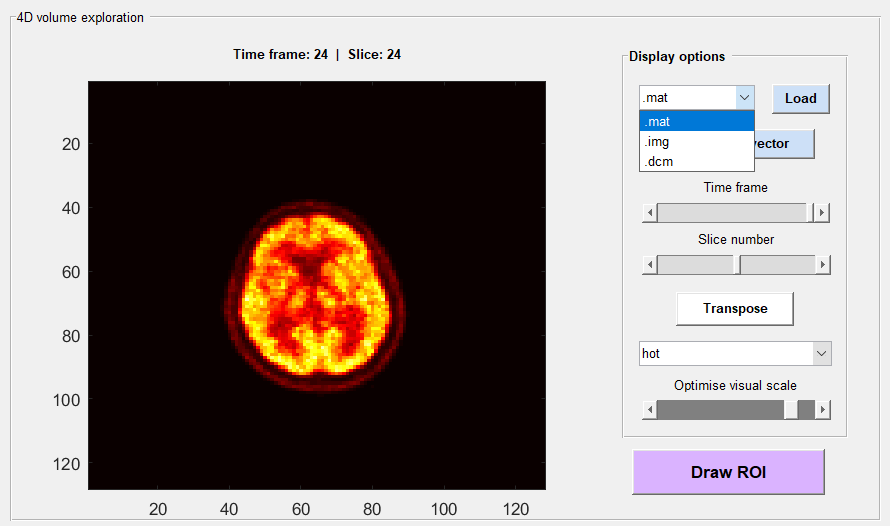
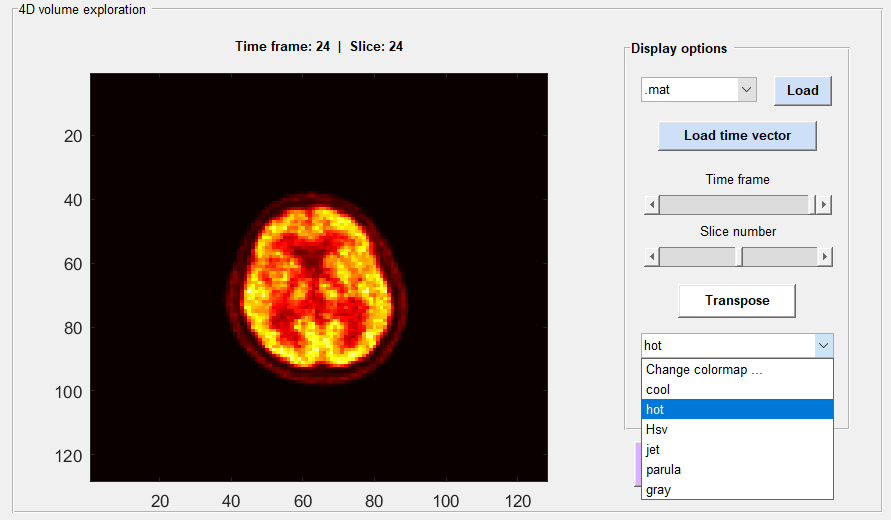
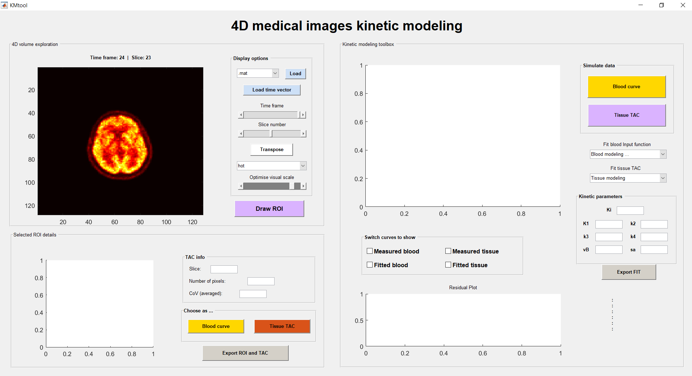
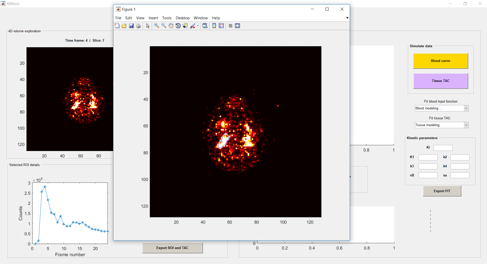
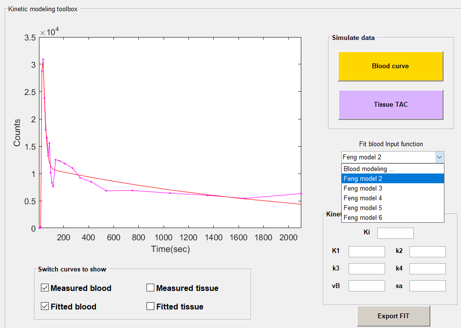
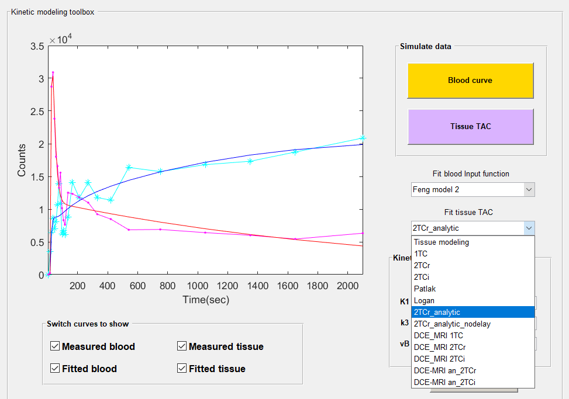
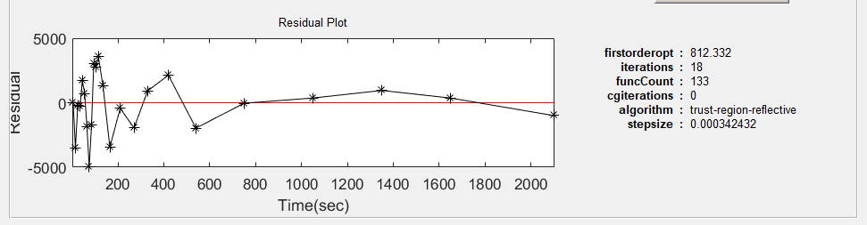

# KMtoolbox
Kinetic Modeling Toolbox designed to estimate kinetic parameters from 4D PET and DCE-MRI dataset at a ROI level

## A few screenshots:

---

#### Loading 4D volume:

---

#### Select colormap and adjust visual scale:

---

#### Main window after loading 4D volume:

---

#### Roi selection mode (example: selecting input function):

---

#### Fitting image-derived AIF with a theoretical model:

---

#### After selecting a tissue ROI, choose the suitable model:

---

#### Fitting result:

---

#### Residuals:

